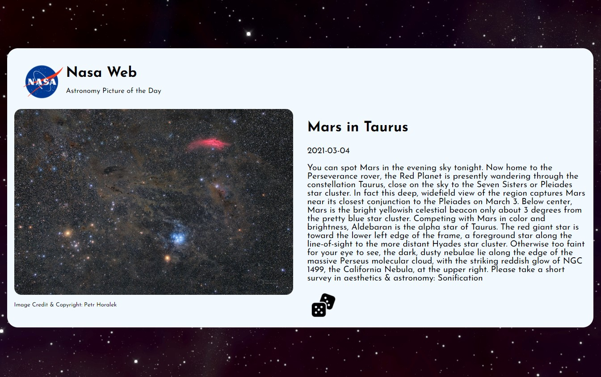

# Nasa Web

Astronomy Picture of the Day

Each day a different image or photograph of our fascinating universe is featured, along with a brief explanation written by a professional astronomer.
Access space data from any random day.

Live - https://nasa-api-new-web.web.app/

## API

[NASA APIs](https://api.nasa.gov/)
